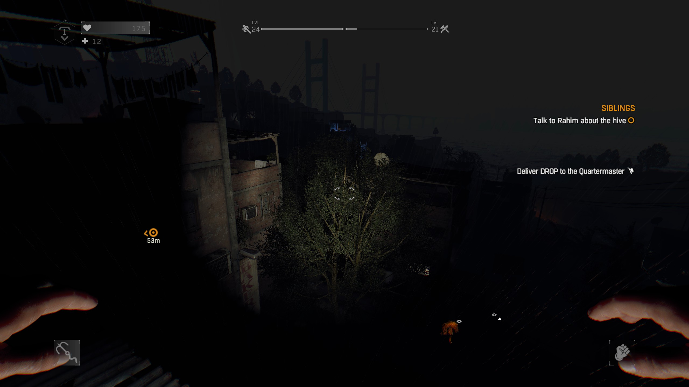

# Dying Light Reignited
### A hardcore mod for only the most hardcore of players. You can make much more powerful weapons but they will cost you far more resources allowing you to be king of the day but you will always be a scampering rat at night.

# Main Features:

## Night

#### Before:

#### After:

- Night time enemies like Volatiles and Night Walkers can see you from much further away and spot you almost instantly
- Much more night time enemies and they wander more freely on the lookout for you
- Pursuits will summon much more night enemies after you and will rise in intensity much quicker
- Volatiles can no longer spit, but don't taunt them from the streetlamp as more will show up to instantly kill you when you make a break for it

## Inventory/Crafting

### Organized Inventory

### Weapon Upgrades

### Upgrading a Weapon

- The inventory has finally been organized to have common craftables at the top and puts the useless weapon blueprints at the bottom
- You can now craft weapon upgrades and elemental upgrades straight from your inventory, although they are expensive
- Weapons now have 4 upgrade slots, allowing you to add 2 King mods to get the max buffs and 2 elemental effects + 1 extra from the new base elemental recipes
- New craftables such as batteries, electronics, metal scrap, steel tubing and more to make more powerful items
- Popular DLC weapons can now be crafted regardless if you have the dlc installed and with more elemental effects you can add
- The crafting recipes for EVERYTHING has become much more expensive, requiring you to gather ample resources even for lockpicks or medkits

## Gameplay

### Feeling Trapped?

- The AI of day zombies has been tweaked to make them much more perceptive of you and summon their comrades to your position
- Plants are overgrown from a lack of humans tending to them, making it harder to spot hidden zombies that might grab you
- Rais' men can be spotted freely roaming the city, hunting zombies and you so be on the lookout!
- Falling distance is significantly reduced, encouraging you to roll much more or drop down incrementally
- Medkits heal you very slowly over time and heal much less health, making you have to stay out of danger for awhile to recover fully
- Finding higher colored tiered weapons is much easier from medium and hard chests, although lockpicking is harder than ever with picks breaking quickly

## Skills
- Requirements to level up fighter and running xp has been significantly increased to create a more memorable struggle to get skills
- Survival levels have increased xp requirements but surviving at night has never been more rewarding yet dangerous
- No more overpowered Stomp nor Camoflauge, learn to survive without them (you'll get used to it quickly enough)
- Grappling hook will take a much longer time to unlock, forcing you to master parkour and building climbing
- The grappling hook has a more limited range and much longer cooldown if you use it twice in a row, the upgraded version isn't much better

## Quests

### Kurt's Cataclysmic Bombs 

### Get really, really, **really** far away!

### Kaboom!

- You will now get **Useful** rewards from quests such as craftplans for elemental weapon upgrades
- Kurt may even be willing to share the blueprints for his original bomb, not the ripoff from earlier
- Tolga and Fatim will give you very useful elemental upgrades, so make a beeline to them!
- I am still able to do all the quests at night, so don't be scared to give it a try!
